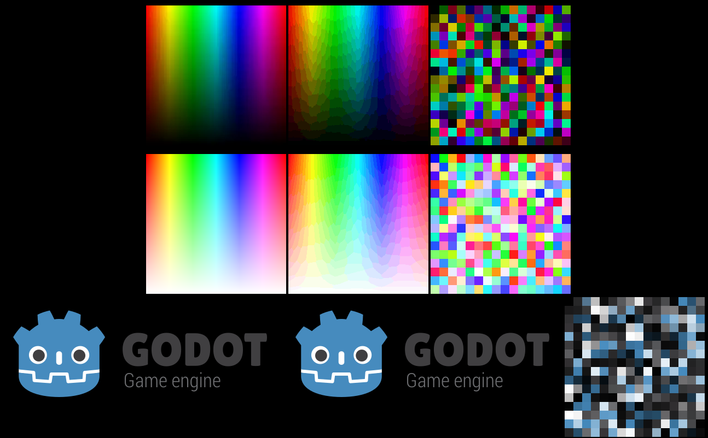
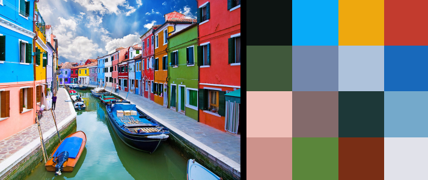
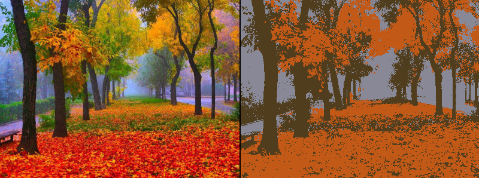
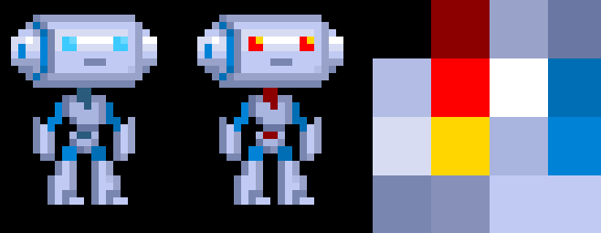

# `ImageIndexed`



## Features

- [x] create and operate on indexed pixels
- [x] generate an optimal palette from an image:
  - with specified number of colors (max: 256);
  - optional dithering (ordered, random).
- [x] create palette and modify palette manually;
- [x] extract color palette from PNG images when loading from disk (instead of expanding);
- [x] save PNG with a palette associated with it:
  - the palette can be modified within Godot;
  - also supports saving indexed color images with "cheap" alpha.

## Implementation details
This does **not** actually add a new `FORMAT_INDEXED` image format as modern GPUs don't actually support it, but index data is stored internally alongside regular pixels *if* an image has a palette. This allows to interchange (swap, extend) index data to pixel data via `apply_palette()` method.

## Use cases and examples

* Taking a screenshot and reducing number of colors to optimize for size:
```gdscript
func save_screenshot():
	get_viewport().render_target_v_flip = true # hmm
	yield(VisualServer, "frame_post_draw")
	get_viewport().render_target_v_flip = false

	screenshot.convert(Image.FORMAT_RGBA8)
	screenshot.generate_palette()
	screenshot.save_png("screenshot_indexed.png")
```

* Finding dominant/average colors in an image:
```gdscript
image.generate_palette(2) # first color is usually background
var dominant_color = image.get_palette_color(1)
# or...
image.generate_palette(8)
var average_colors = image.get_palette()
```



* Image posterization? (8-bit feel):
```gdscript
var image = get_node('sprite').texture.get_data()
image.generate_palette(8)
image.apply_palette()
```



* [Palette swapping](https://github.com/HeartoLazor/godot_palette_swap)
```gdscript
var image = get_node('sprite').texture.get_data()
if not image.has_palette():
     image.generate_palette(16)

image.set_palette_color(5, Color.red)
image.set_palette_color(9, Color.gold)
image.set_palette_color(1, Color.darkred)

image.apply_palette()
```


## Example project

You can try/test these features out here:
https://github.com/Xrayez/godot-image-indexed-example

*Images taken from https://github.com/godotengine/godot-demo-projects/*
